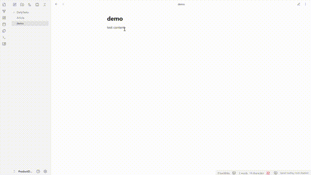
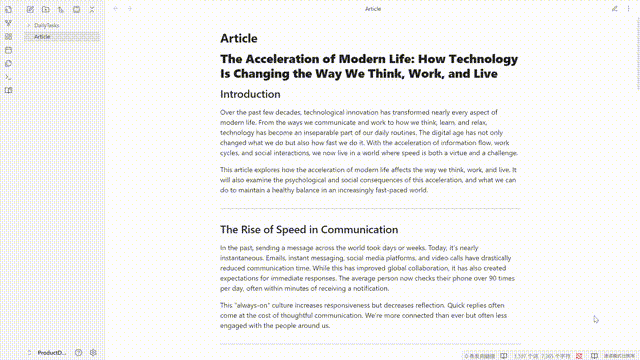

<div align="center">

# 📚 SmartReader - Obsidian Speed Reading Plugin

*Enhance your reading speed with intelligent text highlighting*

[](https://opensource.org/licenses/Apache-2.0)
[](https://obsidian.md/)
[](https://github.com/maigamo/SmartReader)
[](https://github.com/maigamo/SmartReader/releases)
[](https://github.com/maigamo/SmartReader/stargazers)

</div>

---

## 📖 Reading Experience

After enabling speed reading, highlight in reading mode.

 

Change the marking effect.



---

## 🌐 Language / 语言 / 言語

**English** | [中文](#中文版本) | [日本語](#日本語版)

---

## 🚀 Overview

**SmartReader** is an advanced Obsidian plugin that enhances your reading speed through intelligent text highlighting. Perfect for researchers, students, and knowledge workers who want to process large amounts of information efficiently.

### ✨ Key Features

- 🎯 **Smart Highlighting**: Automatically highlights key words at configurable intervals
- 🌍 **Multi-Language Support**: Works seamlessly with English, Chinese, and Japanese text
- 🎨 **Customizable Styles**: Choose from bold, color, underline, or combined highlighting
- ⚡ **Real-Time Processing**: Instant highlighting with adjustable intervals (5-80 words/characters)
- 🛡️ **Non-Destructive**: Never modifies your source files
- 🔧 **Smart Filtering**: Exclude specific folders and file types
- 📱 **Cross-Platform**: Works on desktop and mobile devices

### 🎬 Demo & Screenshots

#### 🖥️ Settings Interface


**Behavior and Activation Settings:**
- ⚙️ Configure auto-processing of new documents
- 📏 Set minimum document length thresholds  
- 📁 Define excluded folders and file patterns
- 🧪 Test current file against filter rules

**Highlighting Rules:**
- 🔢 Choose between word-based or character-based intervals
- 🎚️ Set interval values (5-80 words/characters)
- ⚡ Real-time preview of changes

**Appearance and Style:**
- 🎨 Select from multiple highlighting styles
- 🌈 Customize highlight colors
- 👁️ Visual style previews

#### 📖 Speed Reading in Action

**📝 English Text Processing:**
- Highlights every nth word based on your interval setting
- Maintains natural reading flow while guiding eye movement
- Preserves document formatting and structure

**🈲 Chinese Text Processing:**
- Adapts to Chinese character-based reading patterns
- Supports both character and word-based intervals
- Handles mixed Chinese-English content seamlessly

**🎌 Japanese Text Support:**
- Intelligent handling of hiragana, katakana, and kanji
- Optimized for Japanese reading patterns
- Cultural text processing awareness

#### 🎨 Visual Highlighting Styles

- **🔥 Bold**: `font-weight: bold` - Makes key words stand out with increased font weight
- **🌈 Color**: `color: custom` - Uses customizable colors to draw visual attention
- **📏 Underline**: `text-decoration: underline` - Adds subtle underlines as reading guides
- **💪 Combined**: `bold + underline` - Combines multiple effects for maximum visibility

### 🎯 Perfect For

- 📚 **Students**: Speed through academic papers and textbooks
- 🔬 **Researchers**: Process large volumes of research material efficiently
- 📝 **Content Creators**: Quickly review and digest reference materials
- 💼 **Professionals**: Accelerate document review and analysis
- 🧠 **Knowledge Workers**: Enhance information processing capabilities
- 📖 **Avid Readers**: Improve reading speed without losing comprehension

### 🔒 Privacy & Security

- 🏠 **100% Local Processing**: All text processing happens on your device
- 🚫 **No Data Collection**: Zero telemetry or analytics
- 📄 **Open Source**: Full source code available for review

## 📦 Installation

### 🏪 From Obsidian Community Plugins

1. Open **Settings** in Obsidian
2. Navigate to **Community Plugins**
3. Disable **Safe Mode**
4. Click **Browse** and search for "**SmartReader**"
5. Install and enable the plugin

### 📋 Manual Installation

1. Download the latest release from [GitHub](https://github.com/smartreader/obsidian-smart-reader/releases)
2. Extract files to `VaultFolder/.obsidian/plugins/smart-reader/`
3. Reload Obsidian and enable the plugin

## 🎯 Quick Start Guide

### 🚀 Basic Usage

1. **Open** any document in Reading view (Preview mode)
2. **Toggle** SmartReader using:
   - 🎀 Ribbon icon in the left sidebar
   - 📜 Command palette (`Ctrl/Cmd + P`)
   - 📊 Status bar click
3. **Adjust** settings to customize highlighting

### ⚙️ Configuration

#### 📋 Behavior Settings
```
✅ Auto-process new documents: ON
⏱️ Auto mode delay: 2 seconds
📏 Minimum document length: 200 characters
📁 Excluded folders: Templates/, *.excalidraw
```

#### 🎨 Highlighting Settings
```
🔢 Interval type: Word-based
🎚️ Interval value: 5 words
🎨 Highlight style: Bold and underline
🌈 Highlight color: #FF0000
```

### 🎮 Commands

| Command | Function | Icon |
|---------|----------|------|
| Toggle SmartReader | Enable/disable highlighting | 📚 |
| Process Current Document | Apply highlighting manually | ⚡ |
| Clear Current Document | Remove all highlighting | 🧹 |
| Open Settings | Access configuration | ⚙️ |

## ⚡ Performance & Compatibility

### 📊 Technical Specifications

| Feature | Specification |
|---------|---------------|
| **Supported Files** | `.md`, `.txt`, and any readable text format |
| **Processing Speed** | 1000+ words per second |
| **Memory Usage** | < 10MB RAM for typical documents |
| **File Size Limit** | No hard limit (tested up to 50MB) |
| **Languages** | English, Chinese (Simplified/Traditional), Japanese |
| **Platforms** | Windows, macOS, Linux, Mobile |
| **Obsidian Version** | 1.8.8+ |

### 🚀 Performance Metrics

- ⚡ **Ultra-fast Processing**: Real-time highlighting with minimal latency
- 🔄 **Efficient Memory**: Optimized algorithms for large document handling
- 🎯 **Smart Caching**: Intelligent caching reduces repeated processing
- 📱 **Mobile Optimized**: Smooth performance on mobile devices

## 🔧 Advanced Features

### 📁 Smart File Filtering

Exclude files and folders using powerful pattern matching:

```
Templates/           # Exclude entire folder
*.excalidraw        # Exclude by extension
Archive/*           # Exclude folder and subfolders
Daily Notes/        # Exclude specific folder
**/*.canvas         # Exclude all canvas files recursively
temp-*.md           # Exclude files with specific naming pattern
```

### 🎚️ Interval Optimization

**Recommended Settings:**
- **Beginners**: 3-5 words
- **Intermediate**: 5-8 words  
- **Advanced**: 8-12 words
- **Expert**: 12+ words

### 🌍 Language Detection

SmartReader automatically detects and adapts to:
- **English**: Word-boundary detection
- **Chinese**: Character and word segmentation
- **Japanese**: Mixed script handling
- **Mixed Content**: Intelligent switching


## ❓ Frequently Asked Questions

<details>
<summary><strong>🤔 Does SmartReader work with all Obsidian themes?</strong></summary>

Yes! SmartReader is designed to work seamlessly with all Obsidian themes. The highlighting styles adapt to your current theme's color scheme.
</details>

<details>
<summary><strong>📱 Can I use SmartReader on mobile devices?</strong></summary>

Absolutely! SmartReader is fully compatible with Obsidian mobile apps on both iOS and Android.
</details>

<details>
<summary><strong>🔄 Does the plugin modify my original files?</strong></summary>

No, never! SmartReader only applies visual highlighting in the reading view. Your source files remain completely untouched.
</details>

<details>
<summary><strong>⚡ Will SmartReader slow down Obsidian?</strong></summary>

Not at all! SmartReader is optimized for performance and uses less than 10MB of memory even with large documents.
</details>

<details>
<summary><strong>🌍 What languages are supported?</strong></summary>

Currently: English, Chinese (Simplified & Traditional), and Japanese. More languages are planned for future releases!
</details>

## 🤝 Contributing

We welcome contributions! Please see our [Contributing Guide](CONTRIBUTING.md) for details.

### 🐛 Bug Reports

Found a bug? Please [open an issue](https://github.com/smartreader/obsidian-smart-reader/issues) with:
- 🖥️ Obsidian version
- 🔌 Plugin version  
- 📝 Steps to reproduce
- 🎯 Expected vs actual behavior
- 📱 Device/OS information

### 💡 Feature Requests

Have an idea? [Suggest a feature](https://github.com/smartreader/obsidian-smart-reader/issues) with:
- 📋 Clear description
- 💼 Use case examples
- 🎯 Expected benefits
- 🏆 Priority level

## 📄 License

This project is licensed under the Apache License 2.0 - see the [LICENSE](LICENSE) file for details.

```
Licensed under the Apache License, Version 2.0 (the "License");
you may not use this file except in compliance with the License.
You may obtain a copy of the License at

    http://www.apache.org/licenses/LICENSE-2.0

Unless required by applicable law or agreed to in writing, software
distributed under the License is distributed on an "AS IS" BASIS,
WITHOUT WARRANTIES OR CONDITIONS OF ANY KIND, either express or implied.
See the License for the specific language governing permissions and
limitations under the License.
```

## 🔗 Links

- 🏠 [Homepage](https://github.com/smartreader/obsidian-smart-reader)
- 📚 [Documentation](https://github.com/smartreader/obsidian-smart-reader/wiki)
- 🐛 [Issues](https://github.com/smartreader/obsidian-smart-reader/issues)
- 💬 [Discussions](https://github.com/smartreader/obsidian-smart-reader/discussions)

## 🌟 Support the Project

If SmartReader enhances your reading workflow, show your support:

### 💖 Ways to Support
- ⭐ **Star this repository** - Help others discover SmartReader
- 📢 **Share with your community** - Spread the word about efficient reading
- 🐛 **Report bugs** - Help us improve the plugin
- 💡 **Suggest features** - Share your ideas for new functionality
- 📝 **Write a review** - Share your experience on the Obsidian forum
- 🌐 **Contribute translations** - Help make SmartReader available in more languages

### 🎉 Community

Join our growing community of speed readers:
- 💬 [Discussions](https://github.com/smartreader/obsidian-smart-reader/discussions) - Ask questions and share tips
- 📊 [Reddit Community](https://reddit.com/r/ObsidianMD) - Connect with other Obsidian users
- 🐦 [Follow Updates](https://twitter.com/smartreader) - Stay updated on new features

### 🏆 Hall of Fame

Special thanks to our contributors and the Obsidian community for their valuable feedback and support!

---

# 中文版本

## 🚀 概述

**SmartReader** 是一款先进的 Obsidian 插件，通过智能文本高亮来提升您的阅读速度。非常适合研究人员、学生和知识工作者，帮助他们高效处理大量信息。

### ✨ 主要功能

- 🎯 **智能高亮**: 按可配置间隔自动高亮关键词
- 🌍 **多语言支持**: 无缝支持中文、英文和日文文本
- 🎨 **自定义样式**: 选择加粗、颜色、下划线或组合高亮
- ⚡ **实时处理**: 即时高亮，可调整间隔（5-80个词/字符）
- 🛡️ **非破坏性**: 永不修改源文件
- 🔧 **智能过滤**: 排除特定文件夹和文件类型
- 📱 **跨平台**: 支持桌面和移动设备

### 🎬 演示和截图

#### 🖥️ 设置界面

**行为和激活设置：**
- ⚙️ 配置新文档的自动处理
- 📏 设置最小文档长度阈值
- 📁 定义排除的文件夹和文件模式
- 🧪 测试当前文件的过滤规则

**高亮规则：**
- 🔢 选择基于词或字符的间隔
- 🎚️ 设置间隔值（5-80个词/字符）
- ⚡ 更改的实时预览

**外观和样式：**
- 🎨 从多种高亮样式中选择
- 🌈 自定义高亮颜色
- 👁️ 视觉样式预览

### 🔒 隐私和安全

- 🏠 **100%本地处理**: 所有文本处理都在您的设备上进行
- 🚫 **无数据收集**: 零遥测或分析
- 📄 **开源**: 完整源代码可供审查

## 📦 安装

### 🏪 从Obsidian社区插件安装

1. 在Obsidian中打开**设置**
2. 导航到**社区插件**
3. 禁用**安全模式**
4. 点击**浏览**并搜索"**SmartReader**"
5. 安装并启用插件

### 🎯 快速开始指南

1. 打开**任何文档**的阅读视图（预览模式）
2. 使用：
   - 🎀 左侧边栏中的功能区图标
   - 📜 命令面板（`Ctrl/Cmd + P`）
   - 📊 状态栏点击
3. 调整设置以自定义高亮

### 🎨 高亮样式

- **加粗**: 让关键词突出显示
- **颜色**: 使用可自定义的颜色吸引注意
- **下划线**: 微妙的阅读指南
- **组合**: 加粗+下划线，最大可见性

## 🤝 贡献

我们欢迎贡献！请查看我们的[贡献指南](CONTRIBUTING.md)了解详情。

## 📄 许可证

本项目采用Apache License 2.0许可证 - 详情请见[LICENSE](LICENSE)文件。

Apache License 2.0是一个宽松的开源许可证，允许您：
- ✅ 商业使用
- ✅ 分发
- ✅ 修改
- ✅ 专利使用
- ✅ 私人使用

条件：
- 📄 包含许可证和版权声明
- 📝 说明更改内容

---

# 日本語版

## 🚀 概要

**SmartReader**は、インテリジェントなテキストハイライトによって読書速度を向上させる高度なObsidianプラグインです。研究者、学生、ナレッジワーカーが大量の情報を効率的に処理するのに最適です。

### ✨ 主な機能

- 🎯 **スマートハイライト**: 設定可能な間隔でキーワードを自動ハイライト
- 🌍 **多言語サポート**: 日本語、英語、中国語のテキストをシームレスにサポート
- 🎨 **カスタマイズ可能なスタイル**: 太字、色、下線、または組み合わせハイライトから選択
- ⚡ **リアルタイム処理**: 調整可能な間隔（5-80単語/文字）での即座のハイライト
- 🛡️ **非破壊的**: ソースファイルを決して変更しません
- 🔧 **スマートフィルタリング**: 特定のフォルダーとファイルタイプを除外
- 📱 **クロスプラットフォーム**: デスクトップとモバイルデバイスで動作

### 🎬 デモとスクリーンショット

#### 🖥️ 設定インターフェース

**動作と活性化設定:**
- ⚙️ 新しい文書の自動処理を設定
- 📏 最小文書長のしきい値を設定
- 📁 除外フォルダーとファイルパターンを定義
- 🧪 現在のファイルをフィルタールールに対してテスト

**ハイライトルール:**
- 🔢 単語ベースまたは文字ベースの間隔を選択
- 🎚️ 間隔値を設定（5-80単語/文字）
- ⚡ 変更のリアルタイムプレビュー

**外観とスタイル:**
- 🎨 複数のハイライトスタイルから選択
- 🌈 ハイライト色をカスタマイズ
- 👁️ ビジュアルスタイルプレビュー

### 🔒 プライバシーとセキュリティ

- 🏠 **100%ローカル処理**: すべてのテキスト処理がデバイス上で行われます
- 🚫 **データ収集なし**: テレメトリーや分析はゼロ
- 📄 **オープンソース**: 完全なソースコードがレビュー可能

## 📦 インストール

### 🏪 Obsidianコミュニティプラグインから

1. Obsidianで**設定**を開く
2. **コミュニティプラグイン**に移動
3. **セーフモード**を無効にする
4. **ブラウズ**をクリックして"**SmartReader**"を検索
5. プラグインをインストールして有効にする

### 🎯 クイックスタートガイド

1. 読書ビュー（プレビューモード）で任意の文書を**開く**
2. SmartReaderを**切り替える**方法：
   - 🎀 左サイドバーのリボンアイコン
   - 📜 コマンドパレット（`Ctrl/Cmd + P`）
   - 📊 ステータスバークリック
3. ハイライトをカスタマイズするために設定を**調整**

### 🎨 ハイライトスタイル

- **太字**: キーワードを目立たせる
- **色**: カスタマイズ可能な色で注意を引く
- **下線**: 微妙な読書ガイド
- **組み合わせ**: 太字+下線、最大の視認性

## 🤝 貢献

貢献を歓迎します！詳細については[貢献ガイド](CONTRIBUTING.md)をご覧ください。

## 📄 ライセンス

このプロジェクトはApache License 2.0の下でライセンスされています - 詳細については[LICENSE](LICENSE)ファイルをご覧ください。

Apache License 2.0は寛容なオープンソースライセンスで、以下を許可します：
- ✅ 商用利用
- ✅ 配布
- ✅ 修正
- ✅ 特許使用
- ✅ 私的使用

条件：
- 📄 ライセンスと著作権表示を含める
- 📝 変更内容を明記する

---

## 🏷️ Keywords for SEO

`obsidian plugin`, `speed reading`, `text highlighting`, `productivity`, `markdown`, `note taking`, `reading enhancement`, `knowledge management`, `study tools`, `academic research`, `chinese text processing`, `japanese text support`, `multilingual`, `reading speed`, `focus enhancement`, `visual highlighting`, `document processing`, `obsidian community`, `note reader`, `intelligent highlighting` 